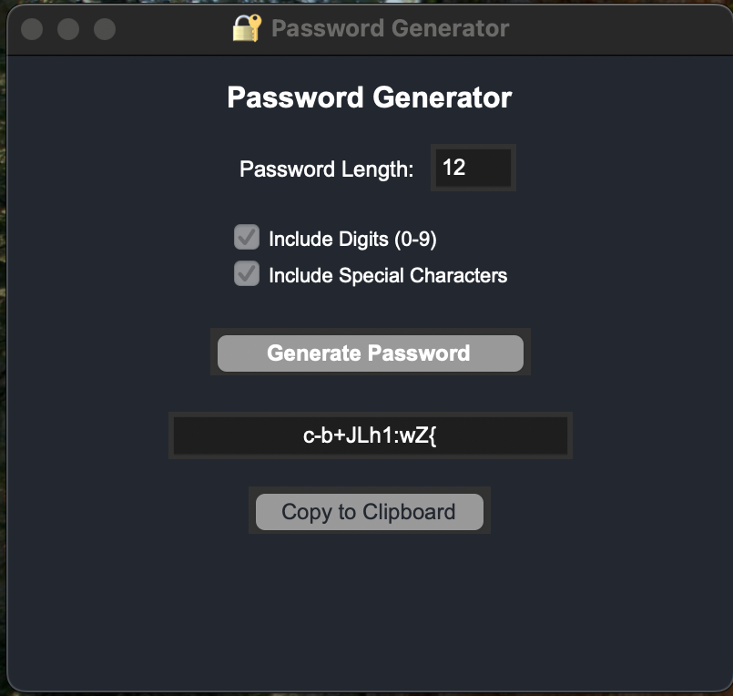

# 🔐 Password Generator – CodSoft Task 03

This project was completed as part of my **Python Programming Internship** at **CodSoft** (Task 03).
The objective of this task was to design and implement a **Password Generator** with a simple and user-friendly **Graphical User Interface (GUI)**.

The program allows users to generate **strong and random passwords** by specifying length and complexity options.

---

## 📌 Task Objective

Develop a **Password Generator Application** that:

* Accepts user input for desired **password length**.
* Allows customization: include **digits** and/or **special characters**.
* Generates a **secure random password** instantly.
* Provides a **GUI interface** for better usability.
* Includes a **copy-to-clipboard** feature for easy use.

---

## 🛠️ Technologies Used

* **Python 3**
* **Tkinter** – for GUI design
* **String & Random modules** – for password generation

---

## 📁 Project Structure

```
password_generator/
├── password_generator.py      # Main Python script with GUI
├── README.md                  # Project overview and instructions
└── SS.png             # GUI interface preview
```

---

## 🖼️ Screenshots

### 🔹 GUI Interface

  

---

## 🎯 Output Example

```
Generated Password: 9f$Kq@1Zr!Lm
```

---

## 🧠 Key Learnings

* Built an **interactive GUI** using Tkinter.
* Learned how to generate **randomized secure passwords**.
* Understood how to handle **user input & clipboard functions**.

---

## 🎓 Internship & Task Details

* **Internship Track**: Python Programming
* **Internship Provider**: CodSoft
* **Task Name**: Password Generator (Task 03)
* **Environment**: Python + Tkinter

---

## 📬 Contact

* **Name**: Difina George
* 📧 **Email**: [difina.georgecs@gmail.com](mailto:difina.georgecs@gmail.com)
* 📍 **Location**: Kerala, India

